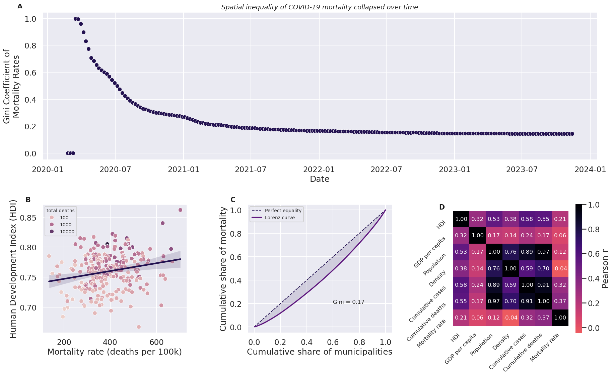

# Municipal Inequality in COVID-19 Mortality in São Paulo

This project analyzes the spatial distribution of COVID-19 mortality across municipalities in the state of São Paulo. Using publicly available data, we examine how mortality rates evolved over time and how inequality between municipalities changed throughout the pandemic.

The analysis focuses on two main aspects:

1. Comparison of mortality rates across municipalities
2. Measurement of spatial inequality using the Gini coefficient

Understanding these patterns helps reveal how the pandemic affected different regions unevenly.

## Data Sources

COVID-19 case and death data were obtained from the public repository maintained by the Fundação SEADE: https://github.com/seade-R/dados-covid-sp/tree/master

The dataset provides daily counts of confirmed cases and deaths for each municipality in the state of São Paulo.

To enable comparisons between municipalities, data was obtained from the Brazilian Institute of Geography and Statistics (IBGE) from the website: https://cidades.ibge.gov.br/brasil/sintese/sp?indicadores=96385,47001,329756,29167,96386

All datasets used in this analysis are publicly available.

---

  

The correlation matrix (Panel D) reveals that the socioeconomic indicators studied (HDI, GDP per capita, and population density) have a weak relationship with COVID-19 mortality rates across São Paulo municipalities. 
The Mortality rate column shows correlations of only r = 0.21 with HDI, r = 0.06 with GDP per capita, and r = −0.04 with density, all of which are near zero and in the case of density practically negligible. 
This means that wealthier, more developed, or more densely populated municipalities did not consistently exhibit higher or lower per-capita death rates. 
What the matrix does reveal is a strong size effect: population correlates very highly with cumulative cases (r = 0.89) and cumulative deaths (r = 0.97), confirming that raw death counts are almost entirely a function of how many people live in a municipality rather than how vulnerable they were. 
Larger municipalities tend to report substantially higher cumulative cases and deaths, reflecting their greater populations and higher levels of mobility and interaction. 
However, when mortality is normalized by population, the variation across municipalities remains substantial and only weakly associated with structural socioeconomic indicators. 

Panel B reinforces this finding visually. 
The scatter of HDI against mortality rate shows a wide dispersion of outcomes at every HDI level — municipalities with similar development indices recorded mortality rates ranging from under 100 to over 600 deaths per 100,000 inhabitants. 
The regression line has a positive slope, but the confidence band is broad and the scatter is large, indicating that HDI explains very little of the variance in per-capita mortality. 
Notably, the darkest dots (representing the highest total death counts, i.e., the largest cities) tend to cluster at higher HDI values, which reflects the confounding size effect already visible in the heatmap: large, developed cities like São Paulo had enormous absolute death tolls but their mortality rates were not extreme. 
Taken together, the figure suggests that the per-capita burden of COVID-19 in São Paulo was driven by factors beyond conventional socioeconomic development — such as healthcare capacity, age structure, timing of local outbreaks, and adherence to non-pharmaceutical interventions — rather than by wealth or urbanization alone.